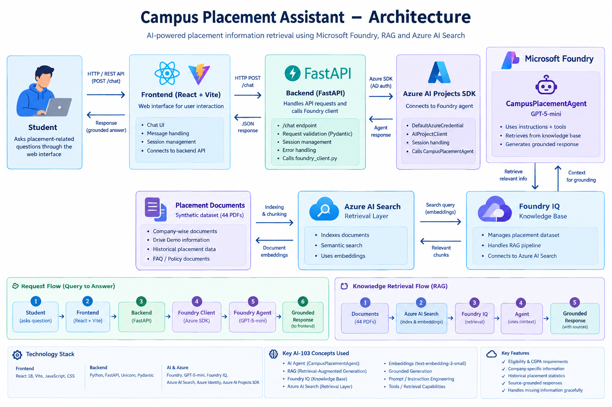

# Campus Placement Assistant (Azure Campus Placement Agent)

An AI-powered chat assistant that answers Chitkara University students' campus-placement questions — eligibility, CGPA/backlog rules, visiting companies, and historical hiring data — grounded in the university's own placement documents via a Microsoft Foundry agent.

> **Data notice:** the placement documents used by this project are a **synthetic dataset** created for academic demonstration. They do not represent official Chitkara University or company placement data.

---

## Table of Contents

1. [Team Members](#team-members)
2. [Problem Statement](#problem-statement)
3. [Solution Overview](#solution-overview)
4. [Key Features](#key-features)
5. [Architecture / Data Flow](#architecture--data-flow)
6. [Technology Stack](#technology-stack)
7. [AI Services and Models](#ai-services-and-models)
8. [Knowledge Base / Dataset](#knowledge-base--dataset)
9. [Setup Instructions](#setup-instructions)
10. [Usage](#usage)
11. [Testing and Results](#testing-and-results)
12. [Screenshots / Demo](#screenshots--demo)
13. [Troubleshooting](#troubleshooting)
14. [Responsible AI](#responsible-ai)
15. [Known Limitations](#known-limitations)
16. [Future Improvements](#future-improvements)
17. [Third-Party Libraries, Datasets and Resources](#third-party-libraries-datasets-and-resources)
18. [Project Structure](#project-structure)
19. [License](#license)
20. [Final Submission Checklist](#final-submission-checklist)

---

## Team Members

| Name | Roll Number |
|---|---|
| Daksh Yadav | 2410992706 |
| Anuj Arora | 2410992681 |
| Rumani Singh | 2410992866 |
| Ishan Batra | 2410993416 |
| Gaganpreet Singh | 2410992729 |

---

## Problem Statement

Campus placement information is normally scattered across notices, PDFs, spreadsheets and word-of-mouth: eligibility criteria differ per company, CGPA and backlog rules vary by drive, and historical hiring statistics are rarely presented in one place. Students often have to cross-reference several documents just to answer a simple question like *"Am I eligible for this company?"*, and information can be easy to misread or misremember.

An AI assistant that can answer these questions directly — in plain language, grounded in the actual placement documents, and honest about what it doesn't know — reduces that friction without replacing the official Placement Cell as the source of truth.

## Solution Overview

The **Campus Placement Assistant** is a chat interface backed by a Microsoft Foundry agent (`CampusPlacementAgent`) that has been given a knowledge base of the university's placement documents.

- A student opens the web frontend and asks a question in plain English (e.g. *"Am I eligible for NVIDIA?"*).
- The frontend sends the message to a small FastAPI backend over HTTP.
- The backend forwards the message to the Foundry agent using the Azure AI Projects SDK, authenticated via `DefaultAzureCredential` (no API keys in code).
- The Foundry agent retrieves relevant placement documents from its **Foundry IQ** knowledge base (backed by **Azure AI Search**) and generates a grounded response.
- The response is returned to the backend, then to the frontend, and rendered in the chat.

The frontend and backend contain **no placement data themselves** — all placement knowledge lives in the Foundry agent's knowledge base, so the application is purely an interface to it.

## Key Features

Verified against the actual frontend/backend code and the screenshots in this repo:

- **Conversational chat interface** — ask placement questions in natural language (`frontend/`)
- **Multi-company eligibility checking** — CGPA, backlog, and program eligibility checked against each company's Drive Demo document, for one or several companies in a single question (see [`screenshots/eligibility-query.png`](screenshots/eligibility-query.png))
- **Historical placement data lookup** — per-year hiring statistics (applied/appeared/shortlisted/hired, semester and program breakdowns) (see [`screenshots/historical-query.png`](screenshots/historical-query.png))
- **Graceful "unavailable information" handling** — the agent explicitly says when a company or statistic isn't in the knowledge base instead of inventing an answer (see [`screenshots/unavailable-query.png`](screenshots/unavailable-query.png))
- **Session-based conversation memory** — each browser tab gets its own Foundry conversation, so follow-up questions keep context (`backend/app/foundry_client.py`)
- **Landing page with suggested questions** — grouped by Eligibility / Companies / Process, so a student can start without typing (`frontend/index.html`)
- **Markdown-formatted responses** — the frontend renders headings, lists, tables, bold text and links from the agent's replies (`frontend/app.js`)
- **Live agent-online/offline indicator** — periodic health check against the backend (`frontend/app.js`)
- **Graceful error handling** — timeouts, offline detection, and failed requests show a retry option instead of a broken UI

## Architecture / Data Flow



```
Student
   │  types a question
   ▼
Frontend (frontend/) — chat UI, session id per tab
   │  HTTP POST /chat
   ▼
Backend API (backend/, FastAPI) — validates request, calls Foundry
   │  Azure AI Projects SDK (DefaultAzureCredential)
   ▼
Microsoft Foundry Agent — CampusPlacementAgent (model: gpt-5-mini)
   │  retrieves grounding context
   ▼
Foundry IQ Knowledge Base — campus-placement-knowledge
   │  backed by
   ▼
Azure AI Search — indexes the 44 synthetic placement PDFs
   │
   ▼
Grounded Response ── back through the agent → backend → frontend → student
```

**Note on the diagram above:** `docs/architecture.png` and `docs/ai103-concepts.md` previously labeled the frontend "React + Vite." This has been corrected — both files now describe the frontend as **Vite + Vanilla JavaScript**, matching the actual code in `frontend/` (`package.json` has no React dependency; `index.html`/`app.js` are plain HTML/CSS/JS with ES modules).

## Technology Stack

| Layer | Technology | Source of truth |
|---|---|---|
| Frontend | HTML5, CSS3, vanilla JavaScript (ES modules) | `frontend/index.html`, `frontend/app.js` |
| Frontend tooling | Vite `^5.4.21` (dev server / bundler) | `frontend/package.json` |
| Backend | Python, FastAPI, Uvicorn (standard extras) | `backend/requirements.txt` |
| Backend validation | Pydantic | `backend/app/models.py` |
| Backend config | python-dotenv | `backend/app/foundry_client.py` |
| Azure auth | Azure Identity (`DefaultAzureCredential`) | `backend/app/foundry_client.py` |
| Azure SDK | `azure-ai-projects>=2.3.0` | `backend/requirements.txt` |
| AI platform | Microsoft Foundry (Agent Service) | `screenshots/foundry-agent.png` |
| Knowledge retrieval | Foundry IQ + Azure AI Search | `docs/ai103-concepts.md`, `screenshots/foundry-iq 1.png`, `screenshots/azure-ai-search.png` |
| Fonts | Google Fonts (Fraunces, Inter), loaded via CDN `<link>` | `frontend/index.html` |
| Dev/runtime environment | Windows + PowerShell (per setup docs), Python virtual env, Node.js/npm | `TROUBLESHOOTING.md` |

No specific Python or Node.js version is pinned anywhere in the repository (no `runtime.txt`, no `engines` field in `package.json`). `TROUBLESHOOTING.md` references a Python 3.13 environment during development.

## AI Services and Models

Based on `docs/ai103-concepts.md` and the Foundry portal screenshots in `screenshots/`:

| Component | Value | Role |
|---|---|---|
| Agent platform | Microsoft Foundry (Agent Service) | Hosts and runs the agent |
| Agent | `CampusPlacementAgent` (Prompt agent) | Understands questions, applies instructions, calls retrieval, generates responses |
| Chat model | `gpt-5-mini` | Generates the agent's responses (visible in `screenshots/foundry-agent.png` and `screenshots/foundry-iq 1.png`) |
| Knowledge base | Foundry IQ knowledge base `campus-placement-knowledge`, source `campus-placement-documents` (44 files) | Grounds responses in the placement dataset |
| Retrieval layer | Azure AI Search (resource `azure-campus-placement-srch-lvdb`) | Indexes and retrieves relevant document chunks for the knowledge base |
| Embedding model | `text-embedding-3-small` (per `docs/ai103-concepts.md`) | Converts text to vectors for semantic retrieval |
| Backend integration | Azure AI Projects SDK (`AIProjectClient.get_openai_client(agent_name=...)`) | Backend's typed connection to the agent |
| Authentication | `DefaultAzureCredential` (Azure Identity) | No API keys in code or `.env` |
| Additional agent tool | Web Search (Grounding with Bing) | Visible as an enabled tool in `screenshots/foundry-agent.png`, alongside knowledge retrieval — not otherwise described in the project's `docs/` |

**Retrieval/grounding approach:** the project implements Retrieval-Augmented Generation (RAG) via Foundry IQ — the agent retrieves relevant chunks from the indexed placement documents before generating a response, rather than relying only on the model's pretrained knowledge. This is documented in `docs/ai103-concepts.md` and demonstrated in `screenshots/eligibility-query.png` and `screenshots/historical-query.png`, where specific figures (e.g. exact CGPA cutoffs) are cited from source documents.

## Knowledge Base / Dataset

`Chitkara_Campus_Placement_Synthetic_Dataset/` contains **44 PDF files**, uploaded as the Foundry IQ knowledge source shown in `screenshots/foundry-iq 2.png`:

- **40 company-specific documents** (2 per company × 20 companies — Accenture, Amazon, Capgemini, Cognizant, DXC Technology, Deloitte, EY, HCLTech, IBM, Infosys, LTTS, Microsoft, NVIDIA, Oracle, Persistent Systems, PwC, SAP, TCS, Tech Mahindra, Wipro):
  - `<Company>_Drive_Demo.pdf` — current drive eligibility criteria, roles, CGPA/backlog rules, selection process
  - `<Company>_Historical_Placement_Data_2019_2025.pdf` — year-by-year hiring pipeline, compensation, and semester/program breakdowns
- **4 global documents:**
  - `Campus_Placement_Policy.pdf`
  - `Campus_Placement_FAQ.pdf`
  - `Placement_Data_Dictionary.pdf`
  - `Placement_Assistant_Guidelines.pdf`

All figures in the dataset are **synthetic**, generated for this academic project. The agent is explicitly instructed (per `docs/responsible-ai.md`) to disclose this and to never present the data as real company or university statistics.

## Setup Instructions

### Prerequisites

- **Python** 3.10+ (developed/tested with Python 3.13 — see `TROUBLESHOOTING.md`)
- **Node.js and npm** (any recent LTS version — no version pinned in the repo)
- **Azure CLI**, signed in via `az login` (the backend uses `DefaultAzureCredential`, which picks up your CLI session locally)
- An **Azure subscription** with access to Microsoft Foundry (this project was developed on an Azure for Students subscription — see `screenshots/azure-students.png`)
- A Microsoft Foundry project containing:
  - An agent named `CampusPlacementAgent` (or your own name — you'll set it in `.env`)
  - A Foundry IQ knowledge base connected to that agent, backed by Azure AI Search, with the dataset in `Chitkara_Campus_Placement_Synthetic_Dataset/` uploaded as its source

### Clone the repository

```bash
git clone https://github.com/Dakshyadav1707/Campus-Placement-Assistant.git
cd Campus-Placement-Assistant
```

### Backend Setup

```powershell
cd backend
python -m venv .venv
.venv\Scripts\activate
$env:PYTHONPATH=""
pip install -r requirements.txt
copy .env.example .env
# edit .env: set FOUNDRY_PROJECT_ENDPOINT and FOUNDRY_AGENT_NAME
az login
uvicorn app.main:app --reload
```

Clearing `PYTHONPATH` before installing/running avoids a known issue where the virtual environment picks up global site-packages instead of its own — see [Troubleshooting](#troubleshooting).

Verify it's running: open `http://localhost:8000/docs` and confirm the Swagger UI loads.

### Frontend Setup

```powershell
cd frontend
copy .env.example .env
npm install
npm run dev
```

Open `http://localhost:5173`. `frontend/.env.example` defaults `VITE_API_BASE_URL` to `http://localhost:8000`; the `.env` copy step is only required if your backend runs somewhere else.

### Environment Variables

**`backend/.env.example`:**

| Variable | Meaning |
|---|---|
| `FOUNDRY_PROJECT_ENDPOINT` | Your Microsoft Foundry project endpoint URL, e.g. `https://<resource>.services.ai.azure.com/api/projects/<project>`. Found on the project's Overview page in the Foundry portal. Not a secret, but specific to your Azure resources. |
| `FOUNDRY_AGENT_NAME` | The name of the deployed Foundry agent to call (`CampusPlacementAgent` in this project). |

**`frontend/.env.example`:**

| Variable | Meaning |
|---|---|
| `VITE_API_BASE_URL` | Base URL the frontend uses to reach the backend. Defaults to `http://localhost:8000` in `app.js` if not set. |

No secrets (API keys, connection strings, passwords) are stored in either `.env.example` file — authentication is handled entirely through `DefaultAzureCredential` / `az login`.

## Usage

With both servers running, open `http://localhost:5173` and either click a suggested question or type your own. Example queries actually demonstrated in this repo's screenshots and docs:

- *"I am a CSE (AI&ML) student with CGPA 8.46 and no active backlog, am I eligible for LTTS and NVIDIA?"* — multi-company eligibility check ([`screenshots/eligibility-query.png`](screenshots/eligibility-query.png))
- *"Give me Nvidia 2025-26 hiring information"* — combined drive + historical data lookup ([`screenshots/historical-query.png`](screenshots/historical-query.png))
- *"Give me the average package offered by google in the past 5 years."* — demonstrates graceful handling of a company not in the dataset ([`screenshots/unavailable-query.png`](screenshots/unavailable-query.png))
- *"What CGPA do I need to be eligible?"*, *"Which companies are visiting?"*, *"How does the placement process work?"* — the landing page's built-in suggested questions (`frontend/index.html`)

## Testing and Results

Full detail is in [`docs/testing.md`](docs/testing.md); summary below.

| Test Area | Purpose | Result |
|---|---|---|
| Eligibility retrieval | Verify company-specific eligibility from Drive Demo docs | Passed |
| Company retrieval (TCS, IBM, Amazon, NVIDIA, Microsoft, ...) | Verify source-specific retrieval | Passed |
| Hallucination resistance (company not in dataset) | Prevent unsupported/invented information | Passed |
| Eligibility logic (historical vs. current source) | Prevent using historical hire data as a current eligibility cutoff | Improved and validated during development |
| Historical data (specific academic years) | Preserve company/year separation | Passed |
| Future-year handling (e.g. 2026–27) | Prevent silently substituting an older year's data | Passed |
| Numerical consistency (e.g. semester/program totals summing correctly) | Verify the agent reasons over retrieved numbers without contradictions | Passed |
| 20-company stress test | Every requested company returned exactly once, no omissions/duplicates | Passed |
| Baseline vs. production instruction comparison | Confirm the stricter production instructions didn't regress correctness | Passed |
| Frontend/backend end-to-end | Health check, `/chat` endpoint, session handling, error handling | Passed |

Testing was evidence-based against live queries and screenshots rather than an automated test suite — there is no `tests/` directory or CI configuration in this repository.

## Screenshots / Demo

| Screenshot | Shows |
|---|---|
| [`screenshots/frontend.png`](screenshots/frontend.png) | Landing page: hero, "Start a chat" CTA, and grouped suggested questions |
| [`screenshots/eligibility-query.png`](screenshots/eligibility-query.png) | Multi-company eligibility check (LTTS + NVIDIA) against a stated CGPA and backlog status |
| [`screenshots/historical-query.png`](screenshots/historical-query.png) | NVIDIA 2025–26 drive + historical hiring data, cited from both document types |
| [`screenshots/unavailable-query.png`](screenshots/unavailable-query.png) | Agent correctly reports Google is not in the knowledge base instead of inventing figures |
| [`screenshots/foundry-agent.png`](screenshots/foundry-agent.png) | `CampusPlacementAgent` configuration in the Microsoft Foundry portal (model: `gpt-5-mini`) |
| [`screenshots/foundry-iq 1.png`](<screenshots/foundry-iq 1.png>) | Foundry IQ knowledge base `campus-placement-knowledge` configuration |
| [`screenshots/foundry-iq 2.png`](<screenshots/foundry-iq 2.png>) | The 44 synthetic placement PDFs uploaded to the knowledge base, all showing `Ready` |
| [`screenshots/azure-ai-search.png`](screenshots/azure-ai-search.png) | The Azure AI Search resource backing the Foundry IQ knowledge base |
| [`screenshots/azure-students.png`](screenshots/azure-students.png) | The Azure for Students subscription used for development |

## Troubleshooting

Full detail is in [`TROUBLESHOOTING.md`](TROUBLESHOOTING.md). Summary of the main issue documented there:

**Backend picks up global Python packages instead of `.venv` (Windows/PowerShell):** caused by a PowerShell `PYTHONPATH` environment variable pointing at the global Python installation, which overrides the virtual environment's own package directory. Fix:

```powershell
$env:PYTHONPATH=""
python -m pip install -r requirements.txt
uvicorn app.main:app --reload
```

## Responsible AI

Full detail is in [`docs/responsible-ai.md`](docs/responsible-ai.md); summary below.

- **Grounded responses:** the agent retrieves from the placement knowledge base before generating an answer, rather than relying solely on the model's pretrained knowledge.
- **Hallucination prevention:** the agent's instructions explicitly prohibit inventing eligibility criteria, CGPA/backlog requirements, statistics, CTC figures, or deadlines; missing information is reported as unavailable rather than guessed.
- **Source and company/year separation:** instructions require keeping Drive Demo (current eligibility) and Historical Placement Data (past statistics) separate, and prevent mixing one company's or one year's data into another's.
- **Synthetic data transparency:** the agent is instructed to disclose that its dataset is synthetic and not official company/university data.
- **Privacy:** the system doesn't require unnecessary personal information beyond what's needed to answer an eligibility question (program, CGPA, backlog status, semester).
- **Human oversight:** the assistant is explicitly informational — the frontend's input hint and landing-page footer both tell students to confirm important details with the Placement Cell, and it is not presented as an official placement authority.

## Known Limitations

- The dataset is entirely **synthetic** — figures do not represent real placement outcomes.
- Conversation-to-Foundry-session mapping is stored **in memory** in the backend (`backend/app/foundry_client.py`); restarting the backend loses all active conversations.
- CORS in `backend/app/main.py` is currently locked to `http://localhost:5173` only, so the deployed frontend origin must be added before any public deployment.
- No user authentication — anyone who can reach the frontend/backend can use the assistant; there's no per-student login or rate limiting.
- The agent also has a Web Search (Grounding with Bing) tool enabled (see `screenshots/foundry-agent.png`), which is not covered by the project's Responsible AI or testing documentation — its behavior and cost implications aren't currently characterized in `docs/`.
- Knowledge-base coverage is limited to the 20 companies and years in the synthetic dataset; anything outside that (as demonstrated with the Google query) is correctly reported as unavailable rather than answered.
- No automated test suite or CI pipeline — testing described in `docs/testing.md` was manual/exploratory against the live agent.

## Future Improvements

Clearly distinct from what's implemented today:

- Real placement data integration with a live update pipeline, replacing the synthetic dataset
- Student authentication and saved profiles (so eligibility doesn't need to be restated each session)
- Persistent conversation storage (replacing the in-memory session map)
- Automated knowledge-base refresh when new drive/historical documents are added
- Expanding beyond the current 20 companies
- An analytics dashboard for the Placement Cell (e.g. common questions, unanswered queries)
- Multilingual support
- Production deployment (CORS configuration, hosting for both frontend and backend, monitoring)
- Automated test suite / CI for the backend API and agent responses
- A documented decision on the Web Search tool (keep, scope, or remove) with corresponding Responsible AI coverage

## Third-Party Libraries, Datasets and Resources

**Backend** (`backend/requirements.txt`):
`fastapi`, `uvicorn[standard]`, `python-dotenv`, `pydantic`, `azure-identity`, `azure-ai-projects>=2.3.0`

**Frontend** (`frontend/package.json`):
`vite ^5.4.21` (development dependency; its transitive dependencies — `esbuild`, `rollup`, `postcss`, `nanoid`, `picocolors`, `source-map-js` — are installed automatically and not used directly by application code)

**Fonts:** Fraunces and Inter, loaded from Google Fonts via CDN (`frontend/index.html`)

**Azure/AI services:** Microsoft Foundry (Agent Service), Foundry IQ, Azure AI Search, Azure AI Projects SDK, Azure Identity — see [AI Services and Models](#ai-services-and-models)

**Dataset:** `Chitkara_Campus_Placement_Synthetic_Dataset/` — synthetic data created for this academic project; does not represent real company or university placement data.

## Project Structure

```
Campus-Placement-Assistant/
├── Chitkara_Campus_Placement_Synthetic_Dataset/   # 44 synthetic placement PDFs (dataset)
├── backend/
│   ├── app/
│   │   ├── main.py             # FastAPI app: /  and /chat routes, CORS
│   │   ├── foundry_client.py   # Only file that talks to Microsoft Foundry
│   │   ├── models.py           # Pydantic request/response models
│   │   └── __init__.py
│   ├── requirements.txt
│   └── .env.example
├── frontend/
│   ├── index.html              # Landing + chat screens
│   ├── app.js                  # Chat logic, Foundry backend calls, markdown rendering
│   ├── style.css
│   ├── package.json
│   ├── vite.config.js
│   └── .env.example
├── docs/
│   ├── architecture.png
│   ├── ai103-concepts.md
│   ├── responsible-ai.md
│   └── testing.md
├── screenshots/                 # Frontend + Foundry/Azure portal screenshots
├── README.md
├── TROUBLESHOOTING.md
└── .gitignore
```

## License

No license file is currently present in this repository. No license is specified — this project is not currently licensed for reuse.

## Final Submission Checklist

- [x] Source code included (`backend/`, `frontend/`)
- [x] README complete (this file)
- [x] Setup documented (backend + frontend, with exact commands)
- [x] Architecture documented (`docs/architecture.png` + data-flow diagram above, with the frontend-stack discrepancy flagged)
- [x] AI services and models documented (Foundry, Foundry IQ, Azure AI Search, `gpt-5-mini`, `text-embedding-3-small`)
- [x] Testing documented (`docs/testing.md`, summarized above)
- [x] Limitations documented
- [x] Future improvements documented and clearly separated from current functionality
- [x] Third-party libraries, datasets and resources acknowledged
- [x] Secrets excluded (`.env` is gitignored; `.env.example` files contain no keys/passwords)
- [x] Team member names
- [x] `docs/architecture.png` and `docs/ai103-concepts.md` frontend label corrected to match the actual vanilla JS implementation